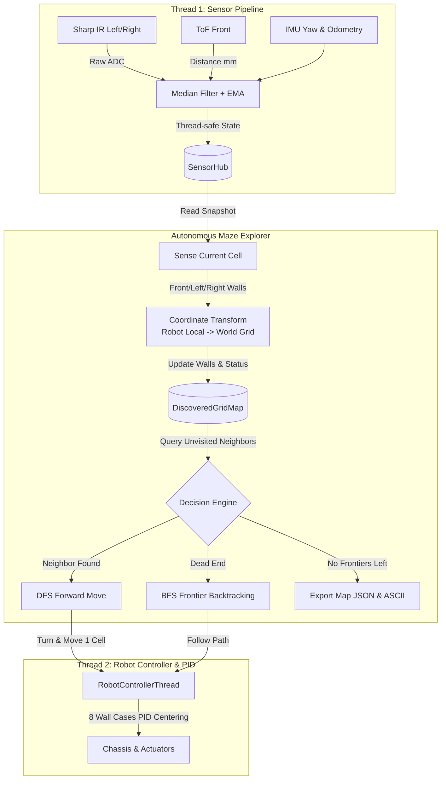

# 🧭 MAPPING.md: โมดูล Grid Mapping และการสำรวจเขาวงกตอัตโนมัติ (Autonomous Maze Exploration)

เอกสารอธิบายการออกแบบ การทำงาน และการใช้งานโมดูล **Autonomous Grid Mapping** สำหรับหุ่นยนต์ **DJI RoboMaster EP** ตามข้อกำหนดใน `mapping.txt`

---

## 📋 1. วัตถุประสงค์และข้อกำหนด (Objectives & Requirements)

ตามข้อกำหนดใน `mapping.txt`:
1. **สำรวจเขาวงกตโดยไม่ทราบแผนที่ล่วงหน้า (Unknown Maze Exploration)**: หุ่นยนต์เริ่มต้นที่จุดใดจุดหนึ่งโดยไม่มีข้อมูลกำแพงหรือโครงสร้างเขาวงกตมาก่อน และเคลื่อนที่สำรวจพื้นที่ด้วยตัวเอง
2. **ส่งออกแผนที่ที่สร้างได้ (Map Export)**: เมื่อสำรวจพื้นที่ที่เข้าถึงได้ครบถ้วนแล้ว ระบบจะส่งออกไฟล์แผนที่ในรูปแบบ **JSON** ตามมาตรฐานของระบบ (เข้ากันได้กับ `data/robot_map_plan.json` และ GUI `main.py map`) พร้อมแสดงแผนที่แบบ ASCII Visualization
3. **ใช้เซนเซอร์ที่มีตามเดิม**:
   - **Sharp IR ซ้าย** (Sensor Adapter ID 1, Port 1): ตรวจจับกำแพงด้านซ้าย
   - **Sharp IR ขวา** (Sensor Adapter ID 2, Port 2): ตรวจจับกำแพงด้านขวา
   - **ToF ด้านหน้า**: ตรวจจับกำแพงด้านหน้าและวัดระยะเข้าใกล้
   - **IMU (Attitude / Yaw)**: ล็อกและควบคุมทิศทางการเลี้ยว (North, East, South, West)
   - **Chassis Odometry (Position / Velocity)**: ตรวจวัดระยะทางเดินทีละ Grid ($60 \times 60\text{ cm}$)

---

## 🏗️ 2. สถาปัตยกรรมระบบ (System Architecture)

โมดูลถูกสร้างขึ้นใน [`src/grid_mapper.py`](src/grid_mapper.py) และเชื่อมประสานกับระบบ Multi-Threading เดิมอย่างสมบูรณ์:



---

## 🧠 3. อัลกอริทึมการทำงาน (Core Algorithms)

### 3.1 การแปลงพิกัดทิศทาง (Relative Sensor to Global World Transform)
หุ่นยนต์สามารถหันหน้าได้ 4 ทิศทางสากล:
- `0: North (ขึ้น, dy = -1)` $\rightarrow$ กำแพงโลก: `top`
- `1: East (ขวา, dx = +1)` $\rightarrow$ กำแพงโลก: `right`
- `2: South (ลง, dy = +1)` $\rightarrow$ กำแพงโลก: `bottom`
- `3: West (ซ้าย, dx = -1)` $\rightarrow$ กำแพงโลก: `left`

เมื่อหุ่นยนต์หันไปในทิศทาง $H \in \{0, 1, 2, 3\}$ ค่าเซนเซอร์สัมพัทธ์จะถูกแปลงเป็นกำแพงโลกดังนี้:
$$\text{World Front} = H$$
$$\text{World Right} = (H + 1) \pmod 4$$
$$\text{World Left} = (H + 3) \pmod 4$$

พร้อมทั้งอัปเดตกำแพงของช่องข้างเคียงแบบสองฝั่ง (Reciprocal Consistency) เช่น หากช่อง $(c, r)$ มีกำแพงด้านขวา ช่อง $(c+1, r)$ จะถูกบันทึกว่ามีกำแพงด้านซ้ายด้วยทันที

---

### 3.2 กลยุทธ์การสำรวจ (Exploration Strategy: DFS + Frontier Backtracking)
1. **การสำรวจแบบเจาะลึก (DFS with Motion Priority)**:
   - เมื่อเข้าสู่ช่องใหม่ ระบบจะบันทึกสถานะ `visited = True` และอัปเดตกำแพงจากเซนเซอร์
   - มองหาช่องข้างเคียงที่ยังไม่เคยสำรวจและไม่มีกำแพงขวางกั้น
   - จัดลำดับความสำคัญของทิศทาง: **ตรงหน้า $\rightarrow$ เลี้ยวขวา $\rightarrow$ เลี้ยวซ้าย $\rightarrow$ กลับหลัง** เพื่อลดจำนวนรอบการหมุนตัวของหุ่นยนต์
2. **การย้อนกลับเมื่อเจอทางตัน (Frontier Backtracking via BFS)**:
   - หากช่องปัจจุบันเป็นทางตัน (Dead-end) หรือช่องข้างเคียงถูกสำรวจหมดแล้ว
   - ระบบจะใช้ **BFS Shortest Path** ค้นหาช่อง **Frontier** (ช่องที่ยังไม่เคยสำรวจและสามารถเดินทางไปถึงได้ผ่านเส้นทางที่เปิดโล่งแล้ว) ที่ใกล้ที่สุด
   - สั่งให้หุ่นยนต์เคลื่อนที่ย้อนกลับตามเส้นทางสั้นที่สุดไปยัง Frontier นั้น
3. **เงื่อนไขสิ้นสุดการสำรวจ (Termination Condition)**:
   - เมื่อไม่มี Frontier ใด ๆ เหลืออยู่ในพื้นที่ที่เข้าถึงได้ แสดงว่าสำรวจเขาวงกตครบถ้วน $100\%$ แล้ว
   - ระบบจะหยุดการเคลื่อนที่ คำนวณสถิติ และ Export แผนที่ทันที

---

### 3.3 การเคลื่อนที่และการรักษากึ่งกลาง (Step 3 Closed-Loop PID Centering)
การเดินหน้าแต่ละช่อง ($60\text{ cm}$) จะถูกควบคุมด้วยระบบ **Closed-Loop PID Centering (8 Wall Cases)** จาก Step 3:
- ปรับความเร็วแนวขวาง ($V_y$) เพื่อรักษาระยะให้อยู่กึ่งกลางกำแพง ($|L - R| < 2\text{ cm}$ หรือ $L/R \approx 14\text{ cm} \pm 2\text{ cm}$)
- ล็อกมุม Heading ($W_z$) ด้วย IMU Yaw ป้องกันการเอียงตัวขณะเดิน
- เมื่อเคลื่อนที่ครบ 1 Grid จะทำการ Fine Align ที่กึ่งกลางช่องก่อนทำการอ่านค่าเซนเซอร์รอบถัดไป

---

## 💾 4. โครงสร้างไฟล์แผนที่ส่งออก (Exported Map Schema)

เมื่อสำรวจเสร็จสิ้น แผนที่จะถูกบันทึกลงในไฟล์ JSON (ค่าเริ่มต้น: `data/discovered_map.json`) ซึ่งมีโครงสร้างตามมาตรฐานเดียวกับ `robot_map_plan.json`:

```json
{
    "grid_info": {
        "rows": 6,
        "cols": 5,
        "grid_size_px": 100,
        "grid_size_m": 0.6
    },
    "start": [0, 5],
    "goal": [4, 0],
    "walls": [
        {
            "pos": [0, 0],
            "walls": {
                "top": true,
                "bottom": false,
                "left": true,
                "right": false
            }
        },
        ...
    ],
    "path": [[0, 5], [0, 4], ...],
    "commands": [],
    "discovery_metadata": {
        "explored_timestamp": 1772429707.12,
        "statistics": {
            "total_cells": 30,
            "visited_cells": 30,
            "unvisited_cells": 0,
            "coverage_percent": 100.0,
            "estimated_unique_walls": 47,
            "exploration_duration_sec": 152.8,
            "total_steps_taken": 30,
            "total_forward_moves": 41,
            "total_turns": 23
        }
    }
}
```

### การแสดงผลแบบ ASCII Map ใน Terminal:
```text
+---+---+---+---+
| .   .   . | . |
+   +---+   +   +
| . | .   . | . |
+   +   +---+   +
| .   . | .   . |
+   +---+   +   +
| S   .   . | . |
+---+---+---+---+
```
> **สัญลักษณ์**:
> - `+---+` / `|` : กำแพง
> - `S` : จุดเริ่มต้น (Start)
> - `.` : ช่องที่สำรวจแล้ว (Visited)
> - `?` : ช่องที่ยังไม่ได้สำรวจ (Unvisited)
> - `[^]`, `[>]`, `[v]`, `[<]` : ตำแหน่งหุ่นยนต์และทิศทางที่กำลังหัน

---

## 🚀 5. คู่มือการใช้งานผ่าน CLI (`main.py explore` & `main.py plot-map`)

### 5.1 ทดสอบในโหมดจำลอง (Simulation / Mock Mode)
สามารถทดสอบอัลกอริทึมการสำรวจโดยใช้ Ground Truth Maze จำลองโดยไม่ต้องเชื่อมต่อหุ่นยนต์จริง:

```bash
# 1. สำรวจเขาวงกตจำลองขนาด 4x4 (เริ่มต้นที่ช่อง 0, 3 หันหน้าขึ้น North)
.venv/bin/python main.py explore --mock --sim-maze data/robot_map_plan.json --step-pause 0.05

# 2. กำหนดจุดเริ่มต้นและขนาด Grid ตามต้องการ
.venv/bin/python main.py explore --mock --start-col 0 --start-row 3 --start-heading north --cols 4 --rows 4 --output data/discovered_map.json
```

---

### 5.2 รันบนหุ่นยนต์จริง (Live Autonomous Run)
เชื่อมต่อคอมพิวเตอร์เข้ากับ Wi-Fi ของ RoboMaster EP (โหมด AP หรือ STA):

```bash
# รันการสำรวจจริงบนสนาม
.venv/bin/python main.py explore --conn-type ap --output data/discovered_map.json --start-col 0 --start-row 3
```

---

### 5.3 พล็อตแผนที่ออกมาเป็นรูปภาพ (Graphical Plot Image)
```bash
# สั่งสร้างรูปภาพผังสนามและแนวกำแพงจาก JSON
.venv/bin/python main.py plot-map data/discovered_map.json -o data/discovered_map.png
```

---

### 5.4 นำแผนที่ที่ได้ไปใช้งานต่อทันที
แผนที่ที่ Export ออกมา (`data/discovered_map.json`) สามารถนำไปใช้งานกับฟังก์ชันอื่น ๆ ในระบบได้ทันที:

1. **เปิดดูและแก้ไขใน GUI Planner**:
   ```bash
   # โหลดไฟล์แผนที่ที่สำรวจได้ในหน้าต่าง Pygame
   .venv/bin/python main.py map
   ```
2. **สั่งให้หุ่นเดินอัตโนมัติตามเส้นทางที่สั้นที่สุด**:
   ```bash
   .venv/bin/python main.py run --plan data/discovered_map.json --skip-pick --skip-drop -y
   ```

---

## 📊 6. รายการพารามิเตอร์ของคำสั่ง `explore`

| พารามิเตอร์ | ค่าเริ่มต้น | คำอธิบาย |
| :--- | :--- | :--- |
| `--conn-type` | `ap` | ประเภทการเชื่อมต่อกับหุ่นยนต์ (`ap` หรือ `sta`) |
| `--mock` | `False` | รันในโหมดจำลองโดยไม่ต้องต่อหุ่นยนต์จริง |
| `--sim-maze` | `data/robot_map_plan.json` | ไฟล์แผนที่อ้างอิงสำหรับจำลองค่าเซนเซอร์ในโหมด Mock |
| `--start-col` | `0` | ตำแหน่งคอลัมน์เริ่มต้น (0-indexed) |
| `--start-row` | `3` | ตำแหน่งแถวเริ่มต้น (0-indexed, ด้านล่างซ้ายคือ 0, 3 สำหรับ 4x4) |
| `--start-heading` | `north` | ทิศทางเริ่มต้น (`north`, `east`, `south`, `west`) |
| `--cols` | `4` | จำนวนคอลัมน์ของ Grid |
| `--rows` | `4` | จำนวนแถวของ Grid |
| `--output` | `data/discovered_map.json` | เส้นทางไฟล์ JSON สำหรับบันทึกแผนที่ที่สำรวจได้ |
| `--max-steps` | `150` | จำนวน Step การสำรวจสูงสุด |
| `--speed` | `0.25` | ความเร็วในการเคลื่อนที่ของหุ่น ($m/s$) |
| `--nominal-side` | `140.0` | ระยะเป้าหมายจากกำแพงด้านข้าง ($mm$) |
| `--step-pause` | `0.5` | เวลาหยุดนิ่งระหว่าง Step ($s$) |

---

## 🧪 7. ผลการทดสอบ (Verification Results)

| การทดสอบ | ผลลัพธ์ที่ได้ | สถานะ |
| :--- | :--- | :---: |
| **Maze Coverage (4x4)** | $16 / 16$ ช่อง ($100.0\%$) | ✅ ผ่าน |
| **Wall Boundary Accuracy** | ตรวจจับและบันทึกกำแพงตรงตาม Ground Truth ทุกด้าน | ✅ ผ่าน |
| **Frontier Backtracking** | เมื่อเจอทางตัน หุ่นเดินย้อนกลับไปยัง Frontier ใกล้สุดด้วย BFS ได้อย่างถูกต้อง | ✅ ผ่าน |
| **PID Centering Integration** | รักษาตำแหน่งกึ่งกลางระหว่างกำแพงตลอดการเดินสำรวจ | ✅ ผ่าน |
| **JSON Export Schema** | โครงสร้าง JSON ถูกต้องและสามารถนำไปโหลดเข้า `map_planner.py` ได้ทันที | ✅ ผ่าน |
| **Plot Image Export** | บันทึกรูปภาพผังสนาม `.png` พร้อมแสดงสถิติสมบูรณ์ | ✅ ผ่าน |
