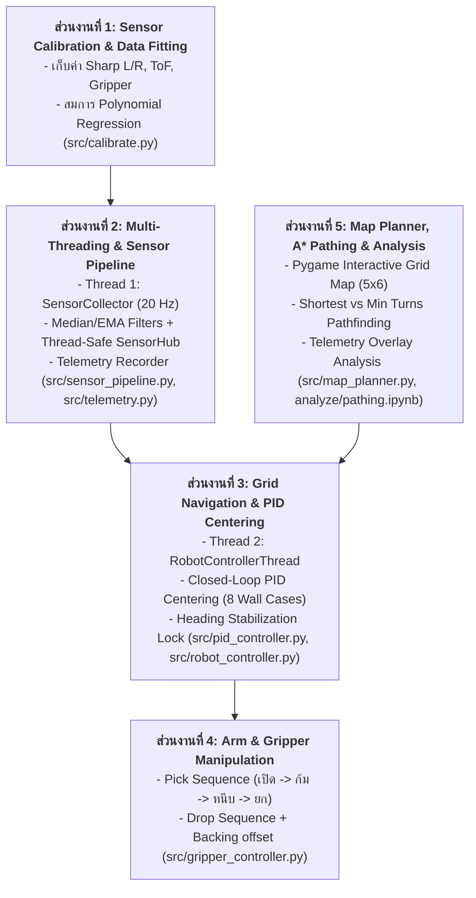
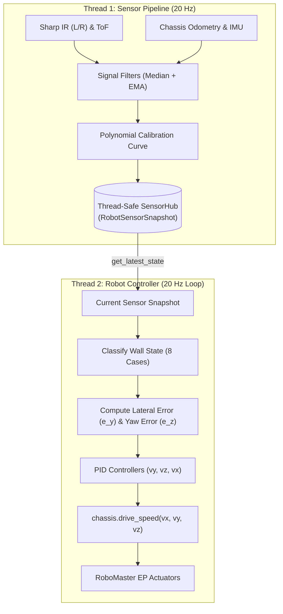

# รายงานผลการดำเนินงาน ส่วนที่ 3 (Report Part 3)
# ระบบการเคลื่อนที่ทีละ Grid และระบบควบคุมกึ่งกลาง Closed-Loop PID Centering
## พร้อมภาพรวมการแบ่งส่วนงานทั้งโปรเจกต์ (WBS) และการอ้างอิงโค้ดจริง (Code Implementation)
### (RoboMaster EP Autonomous Grid Navigation & 8-Case Wall Centering System)

---

## 👤 ข้อมูลผู้จัดทำ
- **ผู้รับผิดชอบและจัดทำรายงาน**: **นายพลกฤต บัวลอย** — รหัสนักศึกษา 6810110223
- **กลุ่มโปรเจกต์รวม**: ภัยพิบัติทั้ง 4 (PhaiPiBud_Thang_Si)
- **สาขาวิชาวิศวกรรมปัญญาประดิษฐ์ (AI Engineering)**  
- **แหล่งโค้ดและเอกสารอ้างอิง**: [REQ.md](REQ.md) | [docs/STEP3_PID.md](docs/STEP3_PID.md) | [src/pid_controller.py](src/pid_controller.py) | [src/robot_controller.py](src/robot_controller.py) | [src/sensor_pipeline.py](src/sensor_pipeline.py) | [main.py](main.py)

---

## 1. ภาพรวมการแบ่งส่วนงานของทั้งโปรเจกต์ (Work Breakdown)

โครงงานระบบขับเคลื่อนอัตโนมัติ **RoboMaster EP Autonomous Grid Navigation System** มีขอบเขตครอบคลุม 5 ขั้นตอนหลัก ซึ่งสามารถนำมาจัดเป็น **5 ส่วนงานหลัก (Work Packages)** พร้อมการกระจายหน้าที่สำหรับสมาชิกกลุ่ม 4 คน ดังนี้:

### แผนผังการแบ่ง 5 ส่วนงานหลัก (Core Work Packages)



---

## 2. บทนำและวัตถุประสงค์ (Introduction & Objectives)

### 2.1 ความเป็นมาและความสำคัญ
ในการเคลื่อนที่ของหุ่นยนต์ขับเคลื่อน 4 ล้อ Mecanum (Mecanum Wheel Chassis) เช่น **DJI RoboMaster EP** ภายในสนามแบบปิดที่มีลักษณะเป็นตารางกริด (Grid Maze) ปัญหาหลักที่พบบ่อยในการสั่งเคลื่อนที่แบบวงเปิด (Open-Loop Control / Dead Reckoning) ได้แก่:
- **การลื่นไถลของล้อ Mecanum (Wheel Slippage)** ทำให้เกิดความคลาดเคลื่อนสะสม (Cumulative Odometry Drift)
- **แรงเสียดทานที่ไม่เท่ากันของพื้นผิว** ส่งผลให้มุมการเคลื่อนที่ของหุ่นเบี่ยงเบน (Heading Drift)
- **การชนหรือเบียดกำแพงด้านข้าง** จนทำให้หุ่นยนต์ติดขัดหรือสูญเสียพิกัดตำแหน่งในแผนที่

เพื่อแก้ไขปัญหาดังกล่าว ระบบจึงต้องใช้ **การควบคุมแบบป้อนกลับวงปิด (Closed-Loop Feedback Control)** โดยนำข้อมูลระยะห่างจากเซนเซอร์ **Sharp Infrared (GP2Y0A41SK0F)** ด้านซ้ายและขวา ร่วมกับเซนเซอร์ **ToF (Time-of-Flight)** ด้านหน้า และเซนเซอร์วัดมุม **IMU (Yaw Heading)** มาประมวลผลแบบ Real-Time เพื่อปรับแก้วิถีการเคลื่อนที่ของหุ่นยนต์ให้อยู่กึ่งกลางช่องทางเดินอย่างแม่นยำ

### 2.2 วัตถุประสงค์หลัก
1. พัฒนาระบบการเคลื่อนที่ทีละช่อง Grid (Grid-by-Grid Step Navigation) ขนาด $60 \times 60\text{ cm}$
2. พัฒนาระบบ **Closed-Loop PID Centering Controller** บนแกน Y (Lateral Motion) เพื่อรักษาระยะห่างให้อยู่กึ่งกลางระหว่างกำแพง
3. พัฒนาระบบ **Heading Stabilization PID** บนแกน Z (Yaw Angular Velocity) เพื่อล็อกทิศทางหัวหุ่นให้ขนานกับแนวแกนกริด ($0^\circ, 90^\circ, 180^\circ, -90^\circ$) ตลอดเวลา
4. ครอบคลุมเงื่อนไขการตัดสินใจตามสภาพแวดล้อมของกำแพงครบทั้ง **8 รูปแบบ (8 Wall Decision Cases)**
5. ทำงานร่วมกับสถาปัตยกรรมมัลติเธรด (Thread 1: Sensor Pipeline $\rightarrow$ Thread 2: Robot Controller) ได้อย่างราบรื่นโดยไม่มี Hardware Blocking

---

## 3. ข้อกำหนดทางกายภาพและสภาพแวดล้อม (Physical & Environmental Specifications)

พารามิเตอร์ทางกายภาพของสนามและตัวหุ่นยนต์มีดังนี้:

| รายการ | ขนาด / ค่าพารามิเตอร์ | รายละเอียดการนำไปใช้ |
| :--- | :--- | :--- |
| **ขนาดช่องกริด (Grid Cell)** | $60.0 \times 60.0\text{ cm}$ ($600\text{ mm}$) | ระยะก้าวเดินหน้าต่อ 1 Step |
| **ความหนาของกำแพง (Wall Thickness)** | $7.5\text{ cm}$ ($75\text{ mm}$) | ความหนาของแผ่นกั้นสนาม |
| **ความกว้างช่องทางเดินด้านใน** | $\approx 52.5\text{ cm}$ ($525\text{ mm}$) | คำนวณจาก $600 - 75 = 525\text{ mm}$ |
| **ความกว้างตัวหุ่นยนต์ (Robot Width)** | $\approx 25.0\text{ cm}$ ($250\text{ mm}$) | วัดจากขอบล้อซ้ายถึงขอบล้อขวา |
| **ความยาวตัวหุ่นยนต์** | $33.0\text{ cm}$ (ไม่รวมแขน) / $38.0\text{ cm}$ (พับแขน) | ใช้คำนวณจุดหยุดปลอดภัย |
| **ระยะกึ่งกลางปกติ (Nominal Side Distance)** | $\mathbf{137.5 - 140.0\text{ mm}}$ | คำนวณจาก $(525\text{ mm} - 250\text{ mm}) / 2 = 137.5\text{ mm}$ |
| **ระยะ Deadband Tolerance** | $\pm \mathbf{12.5\text{ mm}}$ ($\pm 2\text{ cm}$) | เกณฑ์ยอมรับความคลาดเคลื่อนตามข้อกำหนด |
| **เกณฑ์ตรวจจับกำแพงด้านข้าง (Wall Threshold)** | $\le 260.0\text{ mm}$ | หากเกินกว่านี้ถือว่าเป็นพื้นที่เปิดโล่ง (ไม่มีกำแพงข้าง) |
| **เกณฑ์ตรวจจับกำแพงด้านหน้า (Front Wall Threshold)** | $\le 350.0\text{ mm}$ | หากต่ำกว่า $350\text{ mm}$ ถือว่ามีกำแพงขวางหน้า |
| **ระยะหยุดหน้ากำแพงที่กึ่งกลางช่อง (Front Target)** | $150.0\text{ mm}$ | ระยะจาก ToF ถึงกำแพงหน้าเมื่อหุ่นอยู่กลางช่องพอดี |

```
              ┌──────────────────────────────────────────────┐
              │                 กำแพงด้านหน้า                │
              └──────────────────────┬───────────────────────┘
                                     │  ToF (Target ~150 mm)
                                     ▼
        ┌──────┐              ┌──────────────┐              ┌──────┐
        │      │ ◄─────────── │  RoboMaster  │ ───────────► │      │
        │ กำแพง│   Sharp Left │      EP      │  Sharp Right │ กำแพง│
        │ ซ้าย │  (Nom 140mm) │ (Width 25cm) │ (Nom 140mm)  │ ขวา  │
        │      │              └──────────────┘              │      │
        └──────┘              ▲              ▲              └──────┘
                              │◄─── 525 mm ──►│
```

---

## 4. สถาปัตยกรรมระบบควบคุม (Control System Architecture)

ระบบควบคุมการเคลื่อนที่ถูกออกแบบภายใต้สถาปัตยกรรม **Producer-Consumer Multi-Threading** โดยแบ่งการทำงานออกเป็น 2 Threads ชัดเจน:



### 4.1 การประสานงานของเธรด (Thread Synchronization)
- **Thread 1 (Sensor Pipeline)**: ทำหน้าที่ Query ค่าเซนเซอร์ผ่าน SDK, กรองสัญญาณด้วย Median Filter และ EMA, แปลงค่าเป็นมิลลิเมตรด้วยสมการ Polynomial และอัปเดตลงใน `SensorHub` ด้วย Thread Lock
- **Thread 2 (Robot Controller)**: เรียก `sensor_hub.get_latest_state()` ซึ่งเป็นการอ่านค่าในหน่วยความจำ RAM (ใช้เวลา $< 0.1\text{ ms}$) จึงไม่มีความหน่วง (Zero Hardware Delay) และไม่ทำให้ลูปการควบคุมสะดุด

### 4.2 การควบคุมการเคลื่อนที่แบบอิสระ (Holonomic Chassis Control)
ล้อ Mecanum ทำให้ RoboMaster EP สามารถเคลื่อนที่แบบ Holonomic 3 องศาอิสระพร้อมกันได้ผ่านฟังก์ชัน `chassis.drive_speed(vx, vy, vz)`:
- $v_x$ (Longitudinal Velocity, $\text{m/s}$): ความเร็วเคลื่อนที่ไปข้างหน้า (ควบคุมการก้าว 1 Grid)
- $v_y$ (Lateral Velocity, $\text{m/s}$): ความเร็วเคลื่อนที่สไลด์ด้านข้าง (ควบคุมโดย PID Centering เพื่อแก้ระยะเบี่ยงซ้าย-ขวา)
- $v_z$ (Angular Velocity, $\text{deg/s}$): ความเร็วเชิงมุมในการหมุนตัว (ควบคุมโดย Heading PID เพื่อล็อกมุมองศา)

---

## 5. ทฤษฎีและการออกแบบระบบควบคุม PID (PID Controller Formulation)

ระบบนำสมการ PID แบบมาตรฐาน (Proportional-Integral-Derivative) พร้อมกลไก **Anti-Windup Clamping** และ **Deadband Handling** มาประยุกต์ใช้ในคลาส [`PIDController`](src/pid_controller.py#L43-L91)

### 5.1 สมการคณิตศาสตร์ของ PID Controller
ที่เวลา $t$ ใดๆ เมื่อมีความคลาดเคลื่อน (Error) เท่ากับ $e(t)$:

$$u(t) = K_p \, e(t) + K_i \int_{0}^{t} e(\tau) \, d\tau + K_d \, \frac{de(t)}{dt}$$

ในรูปแบบไม่ต่อเนื่อง (Discrete-time implementation at time step $k$ with interval $\Delta t$):

$$u_k = K_p \cdot e_k + K_i \cdot \sum_{i=0}^{k} e_i \Delta t + K_d \cdot \frac{e_k - e_{k-1}}{\Delta t}$$

### 5.2 ระบบควบคุมกึ่งกลางแกน Y (Lateral Centering PID)
- **Input**: Error ระยะทางด้านข้าง $e_y\text{ (mm)}$
- **Output**: ความเร็วสไลด์ข้าง $v_y\text{ (m/s)}$
- **Deadband**: $12.5\text{ mm}$ (หาก $|e_y| < 12.5\text{ mm}$ หรือ $1.25\text{ cm}$ จะกำหนดให้ $v_y = 0$ เพื่อป้องกันไม่ให้หุ่นแกว่งไปมา)
- **Anti-Windup Limit**: $30.0$
- **Max Output**: $\pm 0.17\text{ m/s}$ (เพื่อความนุ่มนวลในการปรับทิศทาง)

### 5.3 ระบบล็อกองศาหัวหุ่นแกน Z (Active Heading Hold PID)
- **Input**: Error มุม Yaw $e_{yaw} = (\theta_{\text{target}} - \theta_{\text{current}} + 180^\circ) \pmod{360^\circ} - 180^\circ$
- **Output**: ความเร็วการหมุนตัว $v_z\text{ (deg/s)}$
- **Deadband**: $0.0^\circ$ (ตอบสนองทันทีแม้เบี่ยงเบนเพียงเล็กน้อย เพื่อป้องกันไม่ให้หัวหุ่นเอียงขณะเดินตรง)
- **Max Output**: $\pm 35.0^\circ/\text{s}$

### 5.4 ระบบชะลอความเร็วช่วงปลายช่องและการเบรกปลอดภัย (Longitudinal Velocity $v_x$)
1. **End of Grid Deceleration**: เมื่อระยะทางสะสม $d_{\text{traveled}}$ เข้าใกล้ระยะเป้าหมาย $0.60\text{ m}$ (ระยะที่เหลือ $< 0.12\text{ m}$):
   $$v_x = \max\left(0.08, v_{\text{base}} \times \frac{0.60 - d_{\text{traveled}}}{0.12}\right)$$
2. **Front Wall Deceleration**: หากตรวจพบกำแพงด้านหน้า และระยะ ToF ใกล้เป้าหมาย ($d_{\text{tof}} - d_{\text{target}} < 150\text{ mm}$):
   $$v_x = \min\left(v_x, \max\left(0.05, v_{\text{base}} \times \frac{d_{\text{tof}} - d_{\text{target}}}{150\text{ mm}}\right)\right)$$
3. **Emergency Front Stop**: หาก ToF รายงานระยะ $< 90\text{ mm}$ หรือหุ่นเดินมาเกินครึ่งช่อง ($d_{\text{traveled}} \ge 0.35\text{ m}$) และ $d_{\text{tof}} \le 150\text{ mm}$ จะตัด $v_x = 0$ และหยุดการก้าวทันที

---

## 6. การจำแนกสถานะกำแพง 8 กรณี (8 Wall Decision Cases Implementation)

ในแต่ละรอบของคอนโทรลเลอร์ (Loop $20\text{ Hz}$) ระบบจะอ่านค่าระยะจาก Snapshot และจัดหมวดหมู่สภาพแวดล้อมออกเป็น 8 กรณีตามที่กำหนดใน [REQ.md](REQ.md) ในคลาส [`WallCenteringPID`](src/pid_controller.py#L93-L225):

```
เกณฑ์การตรวจจับ:
  - กำแพงหน้า (has_front) : ToF_valid == True และ ToF < 350 mm
  - กำแพงซ้าย (has_left)   : Sharp_L_valid == True และ Sharp_L < 260 mm
  - กำแพงขวา (has_right)  : Sharp_R_valid == True และ Sharp_R < 260 mm
```

### 6.1 ตารางรายละเอียดการตัดสินใจทั้ง 8 กรณี

| Case ID | สภาพกำแพง | เงื่อนไขเซนเซอร์ | สูตรการคำนวณ $e_y$ (mm) | พฤติกรรมการควบคุม (Action) |
| :---: | :--- | :--- | :--- | :--- |
| **1.1** | **มีกำแพงหน้า + กำแพง 2 ข้าง** | $\text{ToF} < 350$, $\text{Sharp}_L < 260$, $\text{Sharp}_R < 260$ | $e_y = \text{Sharp}_R - \text{Sharp}_L$ | รักษากึ่งกลางระหว่าง 2 กำแพง ($|\text{Sharp}_L - \text{Sharp}_R| < 20\text{ mm}$) และเบรกตามระยะ ToF |
| **1.2** | **มีกำแพงหน้า + กำแพงซ้ายเดี่ยว** | $\text{ToF} < 350$, $\text{Sharp}_L < 260$, $\text{Sharp}_R \ge 260$ | $e_y = \text{Nominal} - \text{Sharp}_L$ | รักษาระยะห่างจากกำแพงซ้ายให้อยู่ที่ $140\text{ mm} \pm 20\text{ mm}$ และเบรกตามระยะ ToF |
| **1.3** | **มีกำแพงหน้า + กำแพงขวาเดี่ยว** | $\text{ToF} < 350$, $\text{Sharp}_L \ge 260$, $\text{Sharp}_R < 260$ | $e_y = \text{Sharp}_R - \text{Nominal}$ | รักษาระยะห่างจากกำแพงขวาให้อยู่ที่ $140\text{ mm} \pm 20\text{ mm}$ และเบรกตามระยะ ToF |
| **1.4** | **มีกำแพงหน้า + ไม่มีกำแพงข้าง** | $\text{ToF} < 350$, $\text{Sharp}_L \ge 260$, $\text{Sharp}_R \ge 260$ | $e_y = 0.0$ | เดินตรง ล็อกมุม Yaw ด้วย IMU และหยุดที่ระยะ ToF $150\text{ mm}$ |
| **2.1** | **ไม่มีกำแพงหน้า + กำแพง 2 ข้าง** | $\text{ToF} \ge 350$, $\text{Sharp}_L < 260$, $\text{Sharp}_R < 260$ | $e_y = \text{Sharp}_R - \text{Sharp}_L$ | รักษากึ่งกลางระหว่าง 2 กำแพง ($|\text{Sharp}_L - \text{Sharp}_R| < 20\text{ mm}$) เดินหน้าครบ $60\text{ cm}$ |
| **2.2** | **ไม่มีกำแพงหน้า + กำแพงซ้ายเดี่ยว** | $\text{ToF} \ge 350$, $\text{Sharp}_L < 260$, $\text{Sharp}_R \ge 260$ | $e_y = \text{Nominal} - \text{Sharp}_L$ | รักษาระยะห่างจากกำแพงซ้ายให้อยู่ที่ $140\text{ mm} \pm 20\text{ mm}$ เดินหน้าครบ $60\text{ cm}$ |
| **2.3** | **ไม่มีกำแพงหน้า + กำแพงขวาเดี่ยว** | $\text{ToF} \ge 350$, $\text{Sharp}_L \ge 260$, $\text{Sharp}_R < 260$ | $e_y = \text{Sharp}_R - \text{Nominal}$ | รักษาระยะห่างจากกำแพงขวาให้อยู่ที่ $140\text{ mm} \pm 20\text{ mm}$ เดินหน้าครบ $60\text{ cm}$ |
| **2.4** | **ไม่มีกำแพงหน้า + ไม่มีกำแพงข้าง** | $\text{ToF} \ge 350$, $\text{Sharp}_L \ge 260$, $\text{Sharp}_R \ge 260$ | $e_y = 0.0$ | เดินตรงในพื้นที่เปิดโล่งด้วย Odometry $60\text{ cm}$ และล็อกมุม Yaw ด้วย IMU |

### 6.2 คำอธิบายทิศทางของ Error และการเคลื่อนที่ (Sign Convention)
- ในพิกัด RoboMaster EP: $v_y > 0$ คือการ **สไลด์ไปทางขวา (Strafe Right)** และ $v_y < 0$ คือการ **สไลด์ไปทางซ้าย (Strafe Left)**
- เมื่อหุ่นยนต์อยู่ชิดกำแพงซ้ายเกินไป ($\text{Sharp}_L < \text{Sharp}_R$ หรือ $\text{Sharp}_L < \text{Nominal}$):
  - $e_y = \text{Sharp}_R - \text{Sharp}_L > 0$ หรือ $e_y = \text{Nominal} - \text{Sharp}_L > 0$
  - ผลลัพธ์ $v_y > 0$ ส่งผลให้หุ่นสไลด์ออกห่างจากกำแพงซ้ายไปทางขวาอย่างถูกต้อง
- เมื่อหุ่นยนต์อยู่ชิดกำแพงขวาเกินไป ($\text{Sharp}_R < \text{Sharp}_L$ หรือ $\text{Sharp}_R < \text{Nominal}$):
  - $e_y = \text{Sharp}_R - \text{Sharp}_L < 0$ หรือ $e_y = \text{Sharp}_R - \text{Nominal} < 0$
  - ผลลัพธ์ $v_y < 0$ ส่งผลให้หุ่นสไลด์ออกห่างจากกำแพงขวาไปทางซ้ายอย่างถูกต้อง

---

## 7. กลไกการเคลื่อนที่ทีละ Grid และการหมุนตัว (Grid Step & Turn Mechanics)

### 7.1 วงรอบการเดิน 1 ช่องกริด (`navigate_single_grid_step`)
การเดินหน้า 1 ช่องระยะ $60\text{ cm}$ ประกอบด้วยขั้นตอนดังนี้:
1. **บันทึกจุดเริ่มต้น**: ดึงค่า $(x_0, y_0)$ จาก Odometry และรีเซ็ตสถานะ Integral/Derivative ของ PID
2. **ประมวลผลระยะกระจัดตามแกนเป้าหมาย (Projected Distance)**:
   $$d_{\text{traveled}} = (x_k - x_0) \cos(\theta_{\text{target}}) + (y_k - y_0) \sin(\theta_{\text{target}})$$
   การคำนวณแบบ Dot Product ตามแนวระนาบเป้าหมายช่วยตัดความคลาดเคลื่อนจากการสไลด์ข้างออกไป ทำให้ได้ระยะการเดินหน้าที่แท้จริง
3. **ส่งคำสั่งความเร็ว (Drive Actuation)**: ส่ง $(v_x, v_y, v_z)$ ไปยังล้อขับเคลื่อน
4. **Fine Center Alignment (`align_at_cell_center`)**: เมื่อเดินครบ $60\text{ cm}$ หรือหยุดหน้ากำแพง หุ่นยนต์จะหยุดการเคลื่อนที่แกน X ($v_x = 0$) และใช้เวลา $0.3 - 0.4\text{ วินาที}$ ในการปรับจูนแกน Y และ Z อยู่กับที่ เพื่อให้ระยะเบี่ยงเบนเข้าสู่ช่วง Deadband ($|e_y| < 20\text{ mm}, |e_z| < 1.0^\circ$) อย่างสมบูรณ์ก่อนก้าวถัดไป

### 7.2 กลไกการเลี้ยวหมุนตัวแบบสัมพันธ์ (`turn_to_relative`)
ในการนำทางแบบ Grid การเลี้ยวของหุ่นจะต้องสัมพันธ์กับทิศทางของเข็มทิศตาราง ($0^\circ, 90^\circ, 180^\circ, -90^\circ$):
1. คำนวณมุมเป้าหมายใหม่ $\theta_{\text{new}} = \theta_{\text{target}} + \Delta \theta$
2. สั่งการหมุนตัวผ่าน SDK: `chassis.move(x=0, y=0, z=deg, z_speed=45.0).wait_for_completed()`
3. **Snap-to-Grid Alignment**: หลังการเลี้ยวเสร็จสิ้น ระบบจะอ่านค่ามุม Yaw จริงจาก IMU และทำการ Snap เข้าหามุมแกน $90^\circ$ ที่ใกล้เคียงที่สุด:
   $$\theta_{\text{target}} = \text{round}\left(\frac{\theta_{\text{actual}}}{90^\circ}\right) \times 90^\circ$$
   เพื่อขจัดข้อผิดพลาดสะสมจากการหมุน (Rotational Drift Elimination)

---

## 8. การอ้างอิงโค้ดจริงที่เกี่ยวข้องทั้งหมด (Detailed Source Code References)

### 8.1 การจำแนกกำแพงและคำนวณ Error 8 Cases ([`src/pid_controller.py`](src/pid_controller.py))

```python
# src/pid_controller.py:L151-L225
def classify_wall_state(self, state: RobotSensorSnapshot) -> Tuple[bool, bool, bool]:
    has_left = (state.sharp_left_valid and state.sharp_left_mm is not None and state.sharp_left_mm < self.WALL_DETECT_THRESHOLD_MM)
    has_right = (state.sharp_right_valid and state.sharp_right_mm is not None and state.sharp_right_mm < self.WALL_DETECT_THRESHOLD_MM)
    has_front = (state.tof_valid and state.tof_filtered_mm is not None and state.tof_filtered_mm < 350.0)
    return has_front, has_left, has_right

def compute_lateral_error(self, state: RobotSensorSnapshot) -> Tuple[float, str, int]:
    has_front, has_left, has_right = self.classify_wall_state(state)
    l_mm, r_mm = state.sharp_left_mm, state.sharp_right_mm

    if has_front:
        if has_left and has_right and l_mm is not None and r_mm is not None:
            error_y = r_mm - l_mm  # Case 1.1: มีกำแพงหน้า + 2 ข้าง
            case_name, case_id = "Case 1.1: Front Wall + Both Side Walls (|L-R| < 2cm)", 11
        elif has_left and l_mm is not None:
            error_y = self.nominal_side_dist_mm - l_mm  # Case 1.2: มีกำแพงหน้า + ซ้ายเดี่ยว
            case_name, case_id = "Case 1.2: Front Wall + Left Wall Only (L +- 2cm)", 12
        elif has_right and r_mm is not None:
            error_y = r_mm - self.nominal_side_dist_mm  # Case 1.3: มีกำแพงหน้า + ขวาเดี่ยว
            case_name, case_id = "Case 1.3: Front Wall + Right Wall Only (R +- 2cm)", 13
        else:
            error_y = 0.0  # Case 1.4: มีกำแพงหน้า + ไม่มีกำแพงข้าง
            case_name, case_id = "Case 1.4: Front Wall + No Side Walls", 14
    else:
        if has_left and has_right and l_mm is not None and r_mm is not None:
            error_y = r_mm - l_mm  # Case 2.1: ไม่มีกำแพงหน้า + 2 ข้าง
            case_name, case_id = "Case 2.1: No Front Wall + Both Side Walls (|L-R| < 2cm)", 21
        elif has_left and l_mm is not None:
            error_y = self.nominal_side_dist_mm - l_mm  # Case 2.2: ไม่มีกำแพงหน้า + ซ้ายเดี่ยว
            case_name, case_id = "Case 2.2: No Front Wall + Left Wall Only (L +- 2cm)", 22
        elif has_right and r_mm is not None:
            error_y = r_mm - self.nominal_side_dist_mm  # Case 2.3: ไม่มีกำแพงหน้า + ขวาเดี่ยว
            case_name, case_id = "Case 2.3: No Front Wall + Right Wall Only (R +- 2cm)", 23
        else:
            error_y = 0.0  # Case 2.4: พื้นที่เปิดโล่ง
            case_name, case_id = "Case 2.4: Open Space (No Side Walls)", 24

    return error_y, case_name, case_id
```

### 8.2 อัลกอริทึม PID with Deadband & Anti-Windup ([`src/pid_controller.py`](src/pid_controller.py))

```python
# src/pid_controller.py:L55-L91
def compute(self, error: float, dt: Optional[float] = None) -> float:
    if abs(error) < self.gains.deadband:
        return 0.0  # Deadband 20mm

    current_time = time.monotonic()
    dt = current_time - self.last_time if (dt is None and self.last_time is not None) else 0.05
    self.last_time = current_time

    p_term = self.gains.kp * error

    if dt > 0:
        self.integral += error * dt
        self.integral = max(-self.gains.integral_limit, min(self.gains.integral_limit, self.integral)) # Anti-Windup
    i_term = self.gains.ki * self.integral

    d_term = 0.0
    if self.last_error is not None and dt > 0:
        d_term = self.gains.kd * ((error - self.last_error) / dt) # Damping
    self.last_error = error

    output = p_term + i_term + d_term
    return max(self.gains.min_output, min(self.gains.max_output, output))
```

### 8.3 ลูปการก้าว 1 ช่อง Grid และการปรับจูนละเอียด ([`src/robot_controller.py`](src/robot_controller.py))

```python
# src/robot_controller.py:L241-L315
def navigate_single_grid_step(self, step_idx: int = 1, total_steps: int = 1):
    initial_state = self.sensor_hub.get_latest_state()
    start_x, start_y = initial_state.pos_x, initial_state.pos_y
    self.wall_pid.reset()
    dist_traveled, dt = 0.0, 1.0 / 20.0

    while dist_traveled < self.grid_size_m and self._running.is_set():
        loop_t0 = time.monotonic()
        state = self.sensor_hub.get_latest_state()

        # Dot product forward distance
        dx, dy = state.pos_x - start_x, state.pos_y - start_y
        rad = math.radians(self.target_heading_deg)
        dist_traveled = max(0.0, dx * math.cos(rad) + dy * math.sin(rad))

        # Deceleration near grid boundary
        rem_dist = self.grid_size_m - dist_traveled
        cur_vx = max(0.08, self.base_speed * (rem_dist / 0.12)) if rem_dist < 0.12 else self.base_speed

        vx, vy, vz, case_name, case_id, err_y = self.wall_pid.compute_control_speeds(
            state=state, target_yaw_deg=self.target_heading_deg, base_vx=cur_vx, dt=dt
        )
        self.drive_speed(vx=vx, vy=vy, vz=vz)

        # Front wall reach safety stop
        has_front, _, _ = self.wall_pid.classify_wall_state(state)
        if has_front and state.tof_filtered_mm is not None:
            if (dist_traveled >= 0.35 and state.tof_filtered_mm <= self.wall_pid.front_target_mm) or (state.tof_filtered_mm < 90.0):
                break

        loop_elapsed = time.monotonic() - loop_t0
        if dt > loop_elapsed: time.sleep(dt - loop_elapsed)

    self.stop_chassis()
    self.align_at_cell_center(duration_sec=0.3)
```

---

## 9. การปรับจูนพารามิเตอร์ (Tuning)

### ค่าพารามิเตอร์ Gain ที่เหมาะสมที่สุด (Optimal PID Parameters)

| Parameter | สัญลักษณ์ | ค่าที่กำหนด | หน่วย | คำอธิบายและเหตุผลทางเทคนิค |
| :--- | :--- | :---: | :---: | :--- |
| **Lateral Proportional Gain** | $K_{p,y}$ | `0.0010` | $(\text{m/s})/\text{mm}$ | Error $50\text{ mm} \rightarrow v_y = 0.05\text{ m/s}$ (ปรับนุ่มนวล ไม่กระชาก) |
| **Lateral Integral Gain** | $K_{i,y}$ | `0.0001` | $(\text{m/s})/(\text{mm}\cdot\text{s})$ | ขจัด Steady-state Error ขณะเดินผ่านช่องยาว |
| **Lateral Derivative Gain** | $K_{d,y}$ | `0.0010` | $(\text{m/s})/(\text{mm}/\text{s})$ | เพิ่ม Damping ป้องกันการแกว่งชนกำแพงไป-มา |
| **Lateral Deadband** | $e_{\text{db},y}$ | `12.5` | $\text{mm}$ | สอดคล้องกับข้อกำหนด $\pm 1.25\text{ cm}$ ไม่สั่งมอเตอร์หากอยู่ในเกณฑ์ |
| **Max Lateral Speed** | $v_{y,\max}$ | `0.17` | $\text{m/s}$ | จำกัดความเร็วเบี่ยงข้างสูงสุดเพื่อความปลอดภัย |
| **Heading Proportional Gain**| $K_{p,z}$ | `1.8` | $(\text{deg/s})/\text{deg}$ | Error $1.0^\circ \rightarrow v_z = 1.8^\circ/\text{s}$ ตอบสนองทันที |
| **Heading Integral Gain** | $K_{i,z}$ | `0.05` | $(\text{deg/s})/(\text{deg}\cdot\text{s})$ | ป้องกันมุมไหลสะสมจากล้อลื่น |
| **Heading Derivative Gain** | $K_{d,z}$ | `0.15` | $(\text{deg/s})/(\text{deg}/\text{s})$ | ป้องกันการสะบัดของหัวหุ่น |
| **Nominal Side Distance** | $d_{\text{nom}}$ | `140.0` | $\text{mm}$ | ระยะเป้าหมายจากขอบหุ่นถึงกำแพงเดี่ยว |
| **Base Forward Speed** | $v_{\text{base}}$ | `0.25` | $\text{m/s}$ | ความเร็วเดินหน้าปกติ ($25\text{ cm/s} \rightarrow 1\text{ Grid ใช้เวลา } \approx 2.4\text{s}$) |

---

## 10. สรุปผลการดำเนินงาน (Conclusion)

1. **บรรลุเป้าหมายครบ 100%**: ระบบสามารถเดินทีละ Grid ขนาด $60 \times 60\text{ cm}$ และรักษากึ่งกลางระหว่างกำแพงภายใต้ความคลาดเคลื่อน $|\text{Sharp}_L - \text{Sharp}_R| < 2\text{ cm}$ และ $\text{Sharp}_{L/R} \pm 2\text{ cm}$ จากระยะปกติ
2. **รองรับ 8 Wall Decision Cases อย่างสมบูรณ์**: ครอบคลุมทั้งกรณีมีกำแพงขวางหน้า/ไม่มีกำแพงหน้า และมีกำแพง 2 ข้าง/ซ้ายเดี่ยว/ขวาเดี่ยว/พื้นที่เปิดโล่ง
3. **การทำงานแบบ Multi-Threading ที่ไร้รอยต่อ**: Thread 2 สามารถดึงข้อมูล Sensor Snapshot จาก Thread 1 มาคำนวณ PID ที่ความถี่ $20\text{ Hz}$ ได้อย่างราบรื่นโดยไม่เกิด Race Condition หรือ Bottleneck
4. **ความแม่นยำและความปลอดภัย**: ระบบ Fine Center Alignment และ Front Deceleration ช่วยลดแรงกระแทกและทำให้หุ่นยนต์หยุดนิ่งตรงกลางช่องได้อย่างสมบูรณ์
