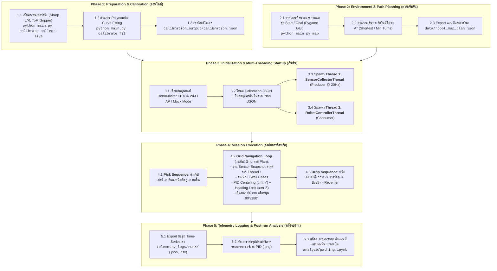

# 🔄 RoboMaster EP Autonomous Grid Navigation System — Workflow

เอกสารฉบับนี้อธิบาย **ลำดับขั้นตอนการทำงาน (Workflow)** ของระบบควบคุมหุ่นยนต์ **DJI RoboMaster EP** สำหรับการปฏิบัติภารกิจนำทางแบบ Grid Navigation อัตโนมัติ พร้อมระบบหยิบและวางวัตถุ (Pick & Drop) อย่างละเอียด ตั้งแต่ขั้นตอนเตรียมการล่วงหน้า การประมวลผลขณะรันจริง จนถึงการวิเคราะห์ผลหลังจบภารกิจ

---

## 🗺️ 1. ภาพรวมลำดับการทำงานทั้งระบบ (End-to-End System Workflow)



---

## 🛠️ 2. ขั้นตอนการทำงานแต่ละเฟสโดยละเอียด (Detailed Workflow Phases)

### 📌 Phase 1: การ Calibrate เซนเซอร์และจัดทำโมเดลแปลงค่า (Sensor Calibration)

จุดประสงค์คือเปลี่ยนค่าดิบ (ADC Value / Distance Raw) ที่อ่านได้จากเซนเซอร์ ให้กลายเป็นระยะทางจริงในหน่วยมิลลิเมตร (mm) เพื่อให้ชุดควบคุมและระบบนำทางใช้งานได้อย่างแม่นยำ

1. **บันทึกข้อมูลระยะจริงและค่าดิบ**:
   - ใช้โมดูล [src/calibrate.py](src/calibrate.py) โดยป้อนระยะจริงจากไม้บรรทัด/ตลับเมตร (mm) และอ่านค่า Raw จากฮาร์ดแวร์
   - ข้อมูลจะถูกจัดเก็บลงใน [data/calibration_measurements.csv](data/calibration_measurements.csv)
2. **การฟิตติ้งสมการ Polynomial Curve**:
   - คำนวณสมการถดถอยพหุนาม (Polynomial Regression Degree 2 หรือ 3) สำหรับ Sharp IR ด้านซ้ายและขวา
   - ฟิตสมการเชิงเส้นสำหรับ ToF และบันทึกพารามิเตอร์ของ Gripper
3. **ส่งออกผลลัพธ์**:
   - บันทึกสัมประสิทธิ์สมการลงใน [calibration_output/calibration.json](calibration_output/calibration.json)
   - สร้างกราฟวิเคราะห์ `calibration_output/sharp_left_calibration.png` และ `calibration_output/sharp_right_calibration.png`

---

### 🗺️ Phase 2: การสร้างแผนที่และการวางเส้นทางล่วงหน้า (Map & Path Planning)

ระบบจำลองสนามแบบ Grid 5x6 ช่อง (ช่องละ 60x60 cm) เพื่อคำนวณลำดับการเลี้ยวและการเดินล่วงหน้า

1. **กำหนดสภาพแวดล้อมสนาม (GUI Pygame)**:
   - รันโปรแกรม `python main.py map` เพื่อเปิดหน้าต่างจัดการแผนที่ [src/map_planner.py](src/map_planner.py)
   - วาดกำแพงภายในสนาม, คลิกวางจุดเริ่มต้น **Start (S)** และจุดเป้าหมาย **Goal (G)**
2. **ประมวลผลเส้นทางด้วยอัลกอริทึม A***:
   - **โหมด Shortest Path**: หาเส้นทางระยะทางสั้นที่สุด
   - **โหมด Minimum Turns**: ให้น้ำหนักโทษการเลี้ยวเพื่อลดจำนวนครั้งที่หุ่นต้องหมุนตัว
3. **การแปลงเป็นคำสั่งขับเคลื่อน (Command Generation)**:
   - แปลงลำดับพิกัด Waypoints เป็นชุดคำสั่งที่หุ่นเข้าใจ เช่น:
     - `Move Forward: 2 cells`
     - `Turn Right (90 deg)`
     - `Move Forward: 1 cells`
   - คำนวณกำแพงสัมพัทธ์รอบตัวหุ่นยนต์ (Relative View: Front, Back, Left, Right)
4. **บันทึกไฟล์แผนการเดิน**:
   - ส่งออกข้อมูลทั้งหมดลงใน [data/robot_map_plan.json](data/robot_map_plan.json)

---

### 🧵 Phase 3: สถาปัตยกรรม Multi-Threading แบบ Producer-Consumer

เมื่อเริ่มต้นระบบ [src/robot_system.py](src/robot_system.py) จะแยกกระบวนการทำงานออกเป็น 2 เธรดอิสระเพื่อไม่ให้การดึงข้อมูลเซนเซอร์หน่วงการควบคุมการเคลื่อนที่

```text
+-------------------------------------------------------------------------------+
|                       RoboMaster EP Hardware / SDK                            |
|  - Sharp Left (id1, port1 ADC)          - ToF Distance (Front mm)             |
|  - Sharp Right (id2, port2 ADC)         - IMU / Attitude (Yaw/Pitch/Roll)     |
|  - Chassis Odometry (X, Y, Z, Vel)      - ESC / Status / Gripper Status       |
+---------------------------------------+---------------------------------------+
                                        | (SDK Subscriptions / Callbacks)
                                        v
+-------------------------------------------------------------------------------+
|                  THREAD 1: SensorCollectorThread (Producer @ 20 Hz)           |
|                                                                               |
|  1. Outlier Rejection Filter   -> ป้องกันสัญญาณกระโดดผิดปกติ                  |
|  2. Median Filter (Window=5)   -> ขจัด Noise แบบ Spike จากแสงสะท้อน IR        |
|  3. Exponential Moving Average -> Low-pass Filter (EMA) เพิ่มความนิ่ง         |
|  4. Polynomial Calibration     -> แปลง ADC เป็นระยะ mm จาก calibration.json    |
|  5. Wall Feature Extraction    -> วิเคราะห์สถานะกำแพงซ้าย/ขวา/หน้า             |
|  6. Telemetry Logger           -> บันทึก Time-series ลง Memory Buffer         |
+---------------------------------------+---------------------------------------+
                                        |
                 Atomic Snapshot Update | (Thread-Safe Lock)
                                        v
+-------------------------------------------------------------------------------+
|                         SensorHub (Shared Memory Hub)                         |
|   - get_latest_state() -> RobotSensorSnapshot (ดึงได้ทันที Zero Latency)      |
|   - wait_for_next_state(timeout)                                              |
|   - get_history_snapshot() -> สำหรับนำไปใช้ใน Grid Mapping เรียลไทม์          |
+---------------------------------------+---------------------------------------+
                                        |
                          ดึง Snapshot  | (Zero Hardware Query Overhead)
                                        v
+-------------------------------------------------------------------------------+
|                  THREAD 2: RobotControllerThread (Consumer)                   |
|                                                                               |
|  - โหลดชุดคำสั่งจาก robot_map_plan.json                                       |
|  - สั่งงานลำดับแขนกลและกริปเปอร์ (Pick & Drop) ผ่าน SimpleGripperController   |
|  - ควบคุมการเคลื่อนที่ทีละ Grid ด้วย Closed-Loop PID Centering (8 Cases)      |
|  - ล็อกมุมหันหุ่นยนต์ (Yaw Lock) ด้วย IMU Heading PID                         |
+-------------------------------------------------------------------------------+
```

---

### 🦾 Phase 4: ลำดับภารกิจและการควบคุมอัตโนมัติ (Mission Execution)

#### 4.1 ลำดับการหยิบของที่จุดเริ่มต้น (Pick Sequence)
ควบคุมผ่าน [src/gripper_controller.py](src/gripper_controller.py):
1. **อ้ากริปเปอร์** (`open()`)
2. **ยื่นและลดระดับแขนกล** ลงระดับวัตถุ (`_move_arm(x=150, y=-200)`)
3. **ปิดกริปเปอร์หนีบจับวัตถุ** (`close()`)
4. **ยกแขนขึ้น** เหนือพื้นดินและดึงแขนเข้าหาตัวเพื่อความปลอดภัยขณะเดินทาง

#### 4.2 การขับเคลื่อนทีละ Grid ด้วยระบบ Closed-Loop PID (Grid-by-Grid Navigation)
ควบคุมผ่าน [src/pid_controller.py](src/pid_controller.py) และ [src/robot_controller.py](src/robot_controller.py):

ในแต่ละสเต็ปการเดิน 60 cm:
1. **อ่าน Snapshot ล่าสุด** จาก `SensorHub` (Thread 1)
2. **จำแนกกรณีสภาพกำแพง 8 รูปแบบ (8 Wall Decision Cases)**:
   - **กรณีมีกำแพงหน้า** (ToF < 350 mm):
     - *กำแพง 2 ข้าง*: คำนวณ $e_y = \text{Sharp}_L - \text{Sharp}_R$ (รักษาผลต่าง < 20 mm)
     - *กำแพงซ้ายข้างเดียว*: คำนวณ $e_y = \text{Sharp}_L - \text{Nominal}$ (140 mm)
     - *กำแพงขวาข้างเดียว*: คำนวณ $e_y = \text{Nominal} - \text{Sharp}_R$ (140 mm)
     - *ไม่มีกำแพงข้าง*: เดินตรงล็อกมุมด้วย IMU และหยุดที่ระยะ ToF กลางช่อง
   - **กรณีไม่มีกำแพงหน้า** (ToF >= 350 mm):
     - คำนวณ Error แกน Y ตามกรณีข้างต้น และเคลื่อนที่ไปข้างหน้าตาม Odometry 60 cm
3. **คำนวณสัญญาณควบคุมความเร็ว**:
   - **$v_y$ (แกน Y)**: ปรับความเร็วเบี่ยงซ้าย-ขวาเพื่อเข้าสู่กึ่งกลางช่อง (มี Deadband 12.5–20 mm)
   - **$v_z$ (แกน Z)**: ปรับแรงบิดเลี้ยวเพื่อล็อกมุม Yaw เป้าหมาย ($0^\circ, 90^\circ, 180^\circ, 270^\circ$)
   - **$v_x$ (แกน X)**: ความเร็วเดินหน้าปกติ (0.25–0.35 m/s)
4. **สั่งการขับเคลื่อนแบบ Holonomic**:
   - เรียก `chassis.drive_speed(x=vx, y=vy, z=vz)` อย่างต่อเนื่องใน Control Loop

#### 4.3 ลำดับการวางของที่จุดเป้าหมาย (Drop Sequence)
1. ตรวจสอบระยะกึ่งกลางเป้าหมายด้วย ToF และ Sharp L/R
2. หุ่นยนต์ถอยหลังเล็กน้อยเพื่อชดเชยตำแหน่งแขนกล (`chassis.move(x=-0.50, y=-0.175)`)
3. ยื่นและลดระดับแขนกลลงแตะพื้น
4. อ้ากริปเปอร์เพื่อปล่อยวัตถุ (`open()`)
5. ยกแขนขึ้น ดึงแขนกลับ และพับเก็บ (`recenter()`)

---

### 📊 Phase 5: การบันทึกและวิเคราะห์ข้อมูล (Telemetry & Trajectory Analysis)

1. **การบันทึกประวัติการรันอัตโนมัติ**:
   - [src/telemetry.py](src/telemetry.py) จัดเก็บข้อมูลการรันแต่ละรอบแยกโฟลเดอร์อัตโนมัติใน `telemetry_logs/run1/`, `telemetry_logs/run2/`, ...
   - เก็บไฟล์ข้อมูลทั้งรูปแบบ `.json` (รวมสถิติสรุป ค่าเฉลี่ย Error, Max Error) และ `.csv` (Time-series)
2. **การสร้างกราฟประสิทธิภาพ**:
   - สร้างไฟล์รูปภาพ `runX_<timestamp>_plot.png` แสดงกราฟ 4 มิติ:
     - กราฟระยะ Sharp L/R เทียบเวลา
     - กราฟระยะ ToF ด้านหน้า
     - กราฟสัญญาณควบคุม $v_y$ จาก PID
     - กราฟมุม Yaw จาก IMU
3. **การวิเคราะห์ Trajectory Overlay ใน Jupyter Notebook**:
   - เปิดสมุดบันทึก [analyze/pathing.ipynb](analyze/pathing.ipynb)
   - แปลงข้อมูลพิกัดจริงจาก Odometry ทับซ้อนลงบน Grid Map จำลอง
   - คำนวณค่าความเบี่ยงเบน MAE และ RMSE เพื่อประเมินความแม่นยำของระบบ

---

## 💻 3. คู่มือคำสั่งการรันงานจริงตาม Workflow (CLI Commands)

| ลำดับขั้นตอน | คำสั่งใน Command Line | จุดประสงค์ |
| :---: | :--- | :--- |
| **1** | `python main.py calibrate collect-live sharp_left` | เก็บข้อมูล Calibrate เซนเซอร์ |
| **2** | `python main.py calibrate fit data/calibration_measurements.csv` | ฟิตสมการและสร้าง `calibration.json` |
| **3** | `python main.py map` | วาดแผนที่ กำหนด Start/Goal และบันทึก Plan JSON |
| **4** | `python main.py simulate --plan data/robot_map_plan.json -y` | ทดสอบรันในโหมดจำลอง (Dry-Run) แบบเต็มรูปแบบ |
| **5** | `python main.py step-test --cells 1 --conn-type ap` | ทดสอบเดิน 1 Grid จริงเพื่อจูน PID Centering |
| **6** | `python main.py turn-test --direction right --conn-type ap` | ทดสอบการหมุนตัว 90° จริง |
| **7** | `python main.py monitor --conn-type ap` | เปิด Live Monitor ดูค่าเซนเซอร์สดจาก Thread 1 |
| **8** | `python main.py run --conn-type ap --plan data/robot_map_plan.json` | **รันภารกิจจริงเต็มรูปแบบ (Pick -> PID Walk -> Drop)** |
| **9** | `python main.py analyze telemetry_logs/run1` | สรุปสถิติและวิเคราะห์ผลลัพธ์หลังจบการรัน |

---

## 🛡️ 4. ระบบความปลอดภัย (Safety & Fail-Safe Mechanisms)

1. **Emergency Stop (Ctrl + C)**: มี Signal Handler ดักจับการขัดจังหวะเพื่อสั่งเบรกหุ่นยนต์ทันที (`chassis.drive_speed(0, 0, 0)`)
2. **Collision Avoidance**: Thread 2 ตรวจสอบระยะ ToF ข้างหน้าตลอดเวลา หากต่ำกว่าระยะปลอดภัยฉุกเฉิน (< 120 mm) หุ่นยนต์จะหยุดการเคลื่อนที่ทันที
3. **Anti-Windup & Output Clamping**: ชุดควบคุม PID มีการจำกัดสะสมค่า Integral และจำกัดความเร็วสูงสุดไม่ให้กระตุกหรือลื่นไถล
4. **Mock Fallback**: หากเชื่อมต่อกับฮาร์ดแวร์จริงไม่สำเร็จ ระบบจะสลับเข้าสู่โหมดจำลอง (Simulation Mode) โดยอัตโนมัติ ไม่เกิด Crash
